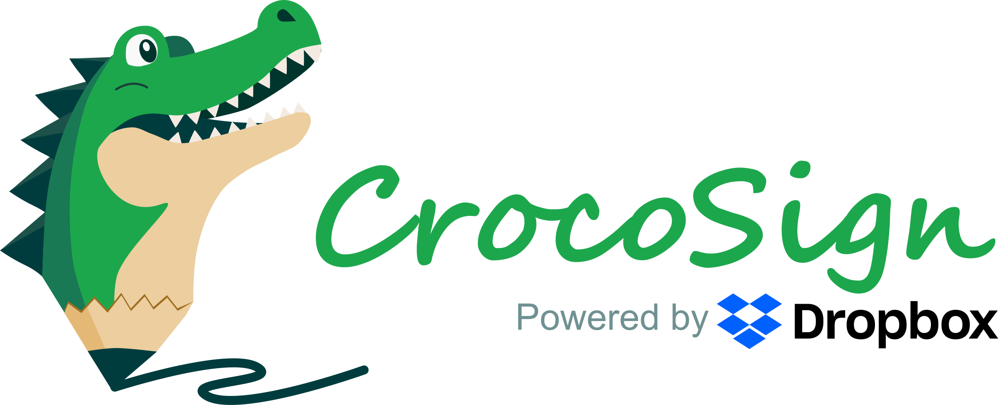
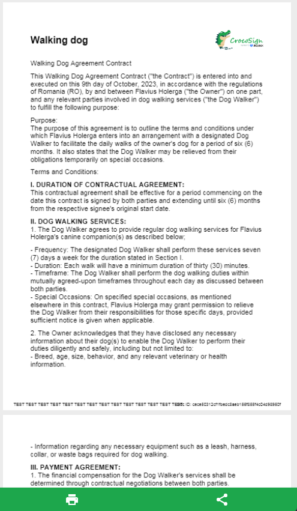

# 🐊 CrocoSign 🐊
## Getting Started

This project is part of the DevPost Sign AI-Powered Agreement Hackathon 2023. Crocosign is a mobile companion for your everyday entrepreneur, that allows you to easily create a legal agreement using the power of AI and easily share it with your partners. 


Everyday, small entrepreneur make deals based solely on verbal agreements due to the effort of going to the legal process. With CrocoSign, we add a simple intermediary that can generate agreements at moment notice as a proof of discussion until more verbose procedures take places.

✅ AI generate PDF documents

✅ Fully editable components

✅ Easily sharable documents & history

✅ Magical signing powered by ✨*DropBox*✨

## 📷 Simple Design 📷



## ⚙️ Technical Reference ⚙️

In order to run the application, the only prerequisites are to have firebase configured and a valid .env file.

```
OPENAI_API_KEY=***
DROPBOX_TOKEN=***
DROPBOX_BASE_URL=https://api.hellosign.com/v3
```

To run the application, simply set up flutter locally - [docs here](https://docs.flutter.dev/get-started/install) and then run the following command:

```
flutter run
```